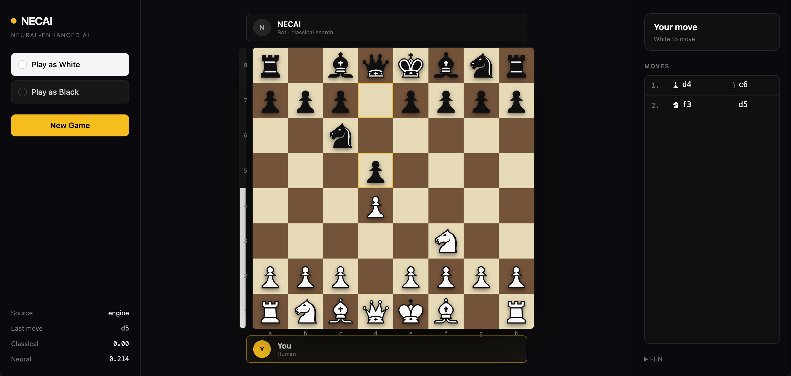

# `NECAI`
**`Neural-Enhanced Chess AI`**

A chess engine combining a C++ classical search with a PyTorch neural evaluator trained on Stockfish-labeled positions.

---



---

## How it plays

For each move the API runs:

1. **Hardcoded first move** — `1.e4` if NECAI is white from the starting position
2. **Opening book** — looks up the current PGN in a Lichess opening dataset; if matched, plays the book move
3. **Classical C++ engine** — negamax + alpha-beta + quiescence at depth 2
4. **Neural eval** — computed for the current position and shown in the UI as a second opinion (display only, not used for move selection)

The classical engine drives all decisions outside of book; the neural eval is informational.

---

## Architecture

```
┌─────────────┐      HTTP       ┌──────────────┐    subprocess    ┌────────────────┐
│  React UI   │ ─────────────►  │  Flask API   │ ───────────────► │  necai_engine  │
│  (Vite)     │                 │  (api/app.py)│                  │  (C++ binary)  │
└─────────────┘                 └──────────────┘                  └────────────────┘
                                       │
                                       ▼
                                ┌──────────────┐
                                │ PyTorch JIT  │
                                │ neural eval  │
                                └──────────────┘
```

| Layer            | Implementation                                                         |
|------------------|------------------------------------------------------------------------|
| Search           | C++ negamax + alpha-beta + quiescence (`engine/search.cpp`)            |
| Classical eval   | C++ heuristic (`evaluator/classical_eval/eval.cpp`)                    |
| Neural eval      | PyTorch ResNet, 6 ResBlocks @ 128 ch (`evaluator/neural_eval/struct.py`) |
| Move generator   | C++ pseudo-legal + legality filter (`documentation/moves.cpp`)         |
| Opening book     | HuggingFace `h4ng/necai/openings` parquet, PGN-prefix lookup           |
| API              | Flask + `python-chess` (`api/app.py`)                                  |
| Frontend         | React + Vite + Tailwind (`frontend/`)                                  |

---

## Project layout

```
NECAI/
├── main.cpp                 # C++ engine entry point
├── Makefile                 # Builds necai_engine + top_moves
├── necai_engine             # Compiled C++ binary
├── api/
│   └── app.py               # Flask API (move endpoint, opening book, neural eval)
├── engine/
│   ├── search.cpp/.h        # Negamax + quiescence
│   ├── top_moves.cpp        # Returns top-K classical candidates
│   ├── hybrid_engine.py     # (Experimental) classical candidates → neural rerank
│   └── neural_engine.py     # (Experimental) Python negamax with neural leaves
├── evaluator/
│   ├── classical_eval/      # C++ static eval (material, PSTs, pawn structure, king safety, mobility)
│   └── neural_eval/
│       ├── struct.py        # Model architecture
│       ├── train.py         # Stockfish-supervised training
│       ├── inference.py     # Single-FEN inference
│       ├── fast_inference.py# Batched JIT inference
│       └── export_jit.py    # TorchScript export
├── documentation/           # Board / move generator (C++)
├── database/                # Memoization parquet builders
├── training/                # Game generators (Stockfish self-play)
├── frontend/                # React UI
└── test/                    # Engine smoke tests
```

---

## Classical search (C++)

- Negamax with alpha-beta pruning
- Move ordering: captures first
- Quiescence search at leaves (extends through captures, with checkmate/stalemate detection so a forced mate at the leaf is scored as `-99999` instead of a static eval)
- Static eval combines material, piece-square tables, pawn structure (doubled, isolated), king pawn shield, and mobility differential

```bash
./necai_engine "<fen>" <depth>
# → {"best_move": "e2e4", "engine_eval": 25, "game_over": false}
```

---

## Neural evaluator

### Training data
- Source: [Lichess chess-position-evaluations](https://huggingface.co/datasets/Lichess/chess-position-evaluations) (Stockfish evals at depth ≥ 18)
- ~50M positions, plus ~30K synthetic material-imbalance positions for grounding

### Model
- Input: `18 × 8 × 8` board planes + 8 scalar features (material diff, mobility, castling rights, en-passant, in-check, move counters, bishop-pair flags)
- Backbone: 6 residual blocks @ 128 channels
- Output: scalar in `[-1, 1]` (white's perspective, after `Tanh`)

### Targets
Stockfish centipawns are mapped to `[-1, 1]`:
```python
target = tanh(cp / 600)     # mate → ±1
```

### Training
- Loss: SmoothL1 (Huber)
- Optimizer: AdamW, LR 1e-3, weight decay 1e-4
- Scheduler: ReduceLROnPlateau (factor 0.5, patience 2)
- Early stop: 5 epochs without improvement

```bash
python -m evaluator.neural_eval.train          # stream from HuggingFace
python -m evaluator.neural_eval.train --from-disk
python -m evaluator.neural_eval.export_jit     # produce JIT model for fast inference
```

---

## Building

```bash
make                  # builds necai_engine
make top_moves        # builds optional candidate generator (used by hybrid_engine)
```

Python deps:
```bash
pip install -r requirements.txt
```

Frontend:
```bash
cd frontend && npm install && npm run dev
```

API:
```bash
python api/app.py     # serves on :5001
```

---

## Decision pipeline (`api/app.py` → `/move`)

1. Validate the incoming FEN — return immediately on game-over
2. Hardcoded `1.e4` if NECAI is white from the start position
3. Opening book lookup against the current PGN
4. Classical C++ engine at depth 2 if no book match
5. Compute neural eval of the current position (display only)
6. Return chosen move + both evals to the UI

---

## Stack

| Layer           | Tool                          |
|-----------------|-------------------------------|
| Languages       | C++17, Python 3.13, JS        |
| Search          | C++ (hand-written)            |
| ML              | PyTorch + TorchScript JIT     |
| Chess library   | `python-chess` (Python side)  |
| API             | Flask + flask-cors            |
| Frontend        | React + Vite + Tailwind       |
| Datasets        | Hugging Face Hub              |
| Self-play       | Stockfish 17                  |

---

## Credit

- [Lichess Database](https://database.lichess.org/) — game data and opening explorer
- [Stockfish](https://stockfishchess.org/) — supervision labels
- [Hugging Face](https://huggingface.co/) — dataset hosting

---

## Status

🚧 Active development.
- Classical search: functional, with quiescence checkmate detection in place
- Neural evaluator: trained but output was poorly calibrated (saturating at ±1); architecture now has a `Tanh` output layer and is being retrained
- Opening book: small (~3.6k named openings); coverage runs out by move 4–5

## License

[MIT](license)
